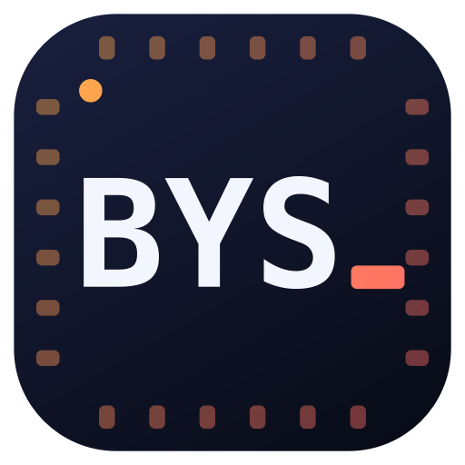

<p align="center"></p>

# BYSTerm — Seri / TCP / UDP hızlı test ve izleme aracı

Hercules'in sadeliği + Eltima Serial Port Monitor'ün izleme özelliği, tek uygulamada.
**Windows, macOS, Linux (Ubuntu, NVIDIA Jetson dahil)** üzerinde aynı kodla çalışır.
SSH/telnet yok, gereksiz menü yok: aç, portu seç, bak.

| Sekme | Ne yapar |
|---|---|
| **Seri** | Aktif portları **isim/açıklama/VID:PID** ile listeler (takıp çıkarınca otomatik yenilenir), standart baud listesi (elle de yazılır), 5–8 bit, parity, stop, akış kontrolü, DTR/RTS, BREAK, CTS/DSR/DCD/RI göstergeleri |
| **TCP İstemci** | host:port'a bağlan, gönder/al |
| **TCP Sunucu** | Dinle, bağlı istemcileri listele, **hepsine veya seçilene** gönder, istemciyi at |
| **UDP** | Yerel porttan dinle, hedefe gönder, gelen paketin kaynağını göster, "son gönderene yanıtla", broadcast |
| **Seri İzleme** | **Başka bir uygulamanın** seri trafiğini iki yönlü izle (Eltima gibi) — aşağıya bakın |

Her sekmede: **ASCII / HEX / HEX+ASCII** görünüm, zaman damgası, renkli RX/TX, duraklat,
temizle, ekranı kaydet, **kayıt** (`.log` = zaman damgalı metin, `.bin` = ham RX baytları),
ASCII (`\r \n \t \xHH` kaçışlı) veya HEX gönderme, satır sonu (CR / LF / CR+LF),
gönderim geçmişi (↑/↓), **periyodik tekrar** (ms), dosya gönder. Aynı türden istediğiniz
kadar sekme açabilirsiniz (üstteki `+ Seri`, `+ UDP` …). Son ayarlar hatırlanır.

## İndir ve çalıştır (kurulum yok)

[**Releases**](../../releases/latest) sayfasından sisteminize uygun dosyayı indirin.
Python, pip ya da başka bir kütüphane **gerekmez**; her şey dosyanın içinde.

| Sistem | Dosya | Nasıl açılır |
|---|---|---|
| **Windows** 10 / 11 (64-bit) | `BYSTerm-windows-x64.exe` | Çift tıklayın. İlk açılışta "Windows bilgisayarınızı korudu" çıkarsa: *Ek bilgi → Yine de çalıştır* (uygulama imzasız olduğu için). |
| **macOS** Apple Silicon (M1–M4) | `BYSTerm-macos-arm64.zip` | Zip'i açın, `BYSTerm.app`'i Uygulamalar'a sürükleyin. İlk açılışta *sağ tık → Aç* (imzasız). Olmazsa Terminal'de: `xattr -dr com.apple.quarantine /Applications/BYSTerm.app` |
| **macOS** Intel | `BYSTerm-macos-x64.zip` | Aynı şekilde |
| **Linux PC** (Ubuntu 18.04 → 24.04+, Debian, Mint…) | `BYSTerm-linux-x64.tar.gz` | `tar xzf BYSTerm-linux-x64.tar.gz && cd BYSTerm && ./BYSTerm`. Menüye eklemek için: `./install.sh` |
| **NVIDIA Jetson**: JetPack 4.x / 5.x / 6.x (Nano, TX2, Xavier, Orin), Raspberry Pi OS 64-bit | `BYSTerm-linux-arm64.tar.gz` | Aynı şekilde |

Linux'ta seri porta erişim için kullanıcınızın `dialout` grubunda olması gerekir (bir kez):
`sudo usermod -aG dialout $USER` → oturumu kapatıp açın. `install.sh` bunu kontrol edip hatırlatır.

Linux paketleri bilerek **Ubuntu 18.04 üzerinde** derlenir. Bu sayede eski ve yeni bütün
dağıtımlarda ve JetPack sürümlerinde aynı dosya çalışır. Her sürüm yayınlanmadan önce
otomatik olarak Ubuntu 18.04 / 20.04 / 22.04 / 24.04 üzerinde, Windows'ta ve macOS'ta
açılıp kendi kendini test eder (`--selftest`).

**Çalıştığını doğrulamak için:** `BYSTerm --selftest`. Pencere açılır, kendi içinde
TCP sunucu↔istemci testi yapar ve `SELFTEST OK` yazıp kapanır.

## Yüksek veri hızında donmaz

Hercules'in yüksek hızda kilitlenmesinin sebebi dil değil, gelen her parçada ekranı yeniden
çizmesidir. BYSTerm'ta:

* Okuma/yazma ayrı thread'lerde yapılır; arayüz hiçbir zaman port/soket üzerinde beklemez.
* Ekran 40 ms'de bir **toplu** güncellenir ve tik başına bir bayt bütçesi vardır.
  Fazlası ekranda atlanır (`... 12.3 MB ekranda gösterilmedi` uyarısı çıkar), ama
  **sayaçlar ve kayıt dosyası her baytı görür**.
* Ekran 20 000 satırla sınırlıdır (eski satırlar düşer, bellek şişmez).

Ölçüm (tek uygulamada aynı anda TCP sunucu sekmesine sınırsız TCP akışı + seri sekmesine
3 Mbaud pty akışı, 5 sn):

| Görünüm | TCP alınan | Kayıp | Arayüzün en uzun takılması |
|---|---|---|---|
| ASCII | ~650 MB/s | 0 bayt | 22 ms |
| HEX | ~450 MB/s | 0 bayt | 35 ms |
| HEX+ASCII | ~700 MB/s | 0 bayt | 17 ms |

Gerçek bir UART 3 Mbaud'da bile ~0.3 MB/s'dir, yani bu sınırın çok altında kalır.

## Seri İzleme (başka uygulamanın trafiğini görmek)

Linux, macOS ve Windows'ta bir port aynı anda tek uygulama tarafından açılabilir. Bu yüzden
izleme, araya girerek yapılır:

```
[Cihaz] ── GERÇEK PORT ── BYSTerm ── SANAL PORT ── [İzlenen uygulama]
                            (iki yönü de gösterir + aynen iletir)
```

**Linux / macOS (ek kurulum gerekmez):**
1. *Seri İzleme* sekmesinde **Gerçek** port = cihazın bağlı olduğu port (ör. `/dev/ttyUSB0`).
2. **Sanal port** = `/tmp/ttyV0` (varsayılan; istediğiniz yolu yazabilirsiniz).
3. *İzlemeyi başlat* → izlemek istediğiniz uygulamada `/dev/ttyUSB0` yerine **`/tmp/ttyV0`** açın.
4. `CIHAZ>` satırları cihazdan, `UYGUL>` satırları uygulamadan gelen veridir.
   *"Uygulamanın baud/format ayarını takip et"* açıksa, uygulama sanal portu hangi baud ile
   açarsa gerçek port da o baud'a geçer.

> Not: Bazı uygulamalar sadece `/dev/tty*` listesini gösterir. Yolu elle yazın ya da sanal
> portu `/dev` altında oluşturmak için BYSTerm'u `sudo` ile çalıştırıp yol olarak
> `/dev/ttyV0` girin.

**Windows:** Sanal port sürücüsü olmadan bu yapılamaz. Ücretsiz **com0com** ile bir sanal
null-modem çifti kurun (ör. `COM11 <-> COM12`; Eltima VSPD varsa o da olur):
1. Gerçek port = cihaz (ör. `COM3`), Sanal port = `COM11`.
2. İzlenen uygulamada `COM12`'yi açın.

**Pasif dinleme (donanım tap):** İki USB-seri dönüştürücünün **RX** uçlarını izlenen hattın
TX ve RX'ine (ve GND'yi ortak) bağlayın, *"Pasif dinleme"*yi işaretleyin, iki portu seçin.
BYSTerm ikisini de yalnızca dinler (`A>` / `B>`) ve tek zaman çizelgesinde gösterir. Bu mod
hattaki cihazlara hiç dokunmaz.

## Kaynaktan çalıştırma / derleme (geliştirici için)

```bash
pip install pyserial PyQt5          # veya PySide6
python3 src/bysterm.py
python3 src/test_bysterm_core.py    # çekirdek testleri
```

Tek dosya paket: `pip install pyinstaller` → `python3 ci/build.py` → `release/`.
Linux için tüm sistemlerde çalışan paket: `docker run --rm -v "$PWD":/src -w /src ubuntu:18.04 bash ci/build_linux_docker.sh`

**Yeni sürüm yayınlamak:** `src/bysterm.py` içindeki `APP_VERSION`'ı artırın, sonra
GitHub → **Actions** → *Build & Release* → **Run workflow** → sürümü yazın (ör. `1.0.1`). (Veya `git tag v1.0.1 && git push origin v1.0.1`.) GitHub Actions bütün platformları derler,
test eder ve Releases'a koyar.

| Dosya | İçerik |
|---|---|
| `src/bysterm.py` | Arayüz (Qt: PySide6 → PyQt5 → PySide2 sırasıyla denenir) |
| `src/bysterm_core.py` | Qt'siz çekirdek: transport'lar, port tarama, biçimleyici, köprü |
| `src/test_bysterm_core.py` | Çekirdek testleri |
| `ci/` | Paketleme (PyInstaller), Linux Docker derlemesi, selftest betikleri |
| `.github/workflows/release.yml` | Otomatik derleme + Release |
